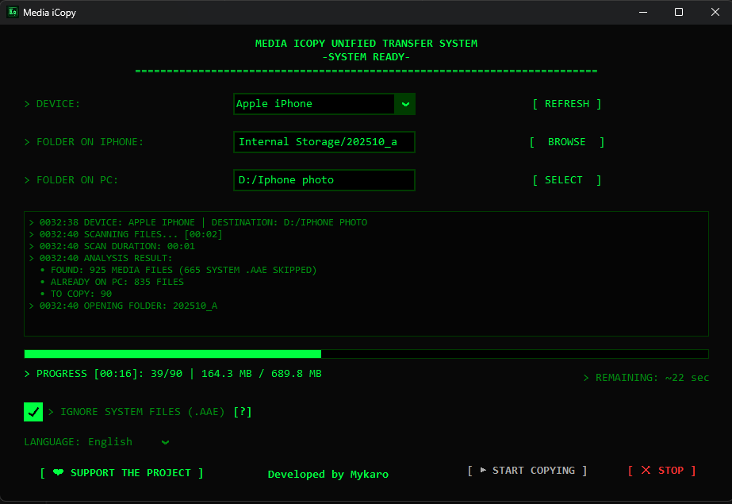

# Media iCopy

> **Reliable iOS device photo and video transfer for Windows — safe, stable, and free.**

  

> _(Portable — No installation required. Just download and run!)_

---

## ❓ Why Media iCopy?

Copying photos from an iOS device to Windows through File Explorer seems simple — until it isn't.  
Large transfers hang, connections drop halfway through, and you end up with duplicates or missing files.

Media iCopy was built to fix exactly that: stable transfers, no duplicates, your folder structure preserved — every time.

---

## 🚀 How It Works

1. Download `MediaiCopy.exe` and run it (no installation needed)
2. Connect your iOS device to the PC via cable and tap **Trust** on your device
3. Choose the source folders/directories on your device
4. Choose the destination folder on your PC
5. Hit **Copy** — only new photos and videos will be transferred

That's it.

---

## ✨ Features

- **Copies only new files** — skips what's already been transferred, so large libraries stay manageable and no file ever gets duplicated.  
  _Compares files against the local destination before each transfer._

- **Preserves folder structure** — your photos land exactly where they came from (e.g., `DCIM/100APPLE`), not in one giant mixed pile.

- **Reliable transfers on Windows** — more stable than the standard Windows copy for iOS device media.  
  _Uses Windows Shell API for improved MTP connection reliability._

- **Retro terminal interface** — a Fallout-inspired UI that's actually pleasant to look at, with Ukrainian and English language support.

- **Auto-update check** — quietly checks for a newer version on startup, so you're always up to date.

---

## 🔒 Privacy & Security

**Your files never leave your computer.**

- **100% Local** — all transfers happen directly between your iOS device and your PC. No cloud, no servers, no middlemen.
- **Zero Telemetry** — Media iCopy does not collect, transmit, or store any of your personal data or media files.
- **One network request** — the only time the app connects to the internet is at startup, to check if a newer version is available on GitHub. Nothing else.

---

## 💻 System Requirements

- Windows 10 or later
- iOS device connected via cable
- "Trust This Computer" confirmation on your iOS device when prompted

---

## 🐛 Feedback

If something doesn't work the way you'd expect, or you have an idea for a new feature — open an Issue on GitHub or write to me on Reddit: https://www.reddit.com/user/by_mykaro/  
Every report helps make Media iCopy better.

---

> Released under the GNU General Public License v3.0 (GPLv3).
